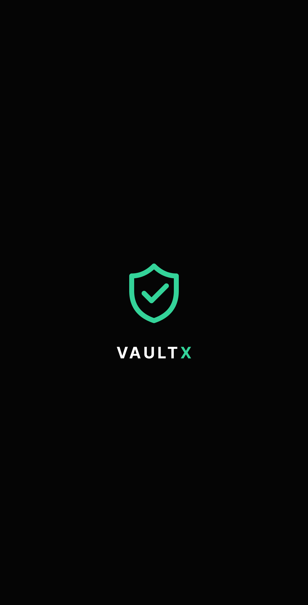
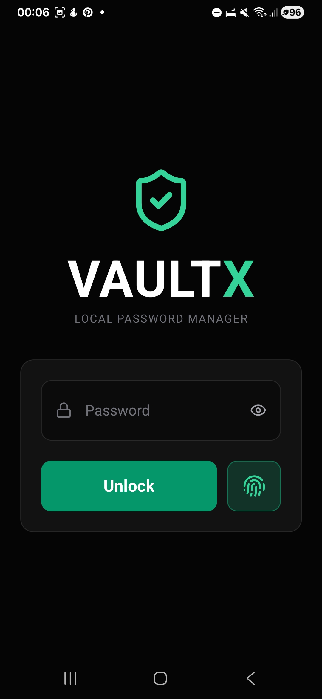
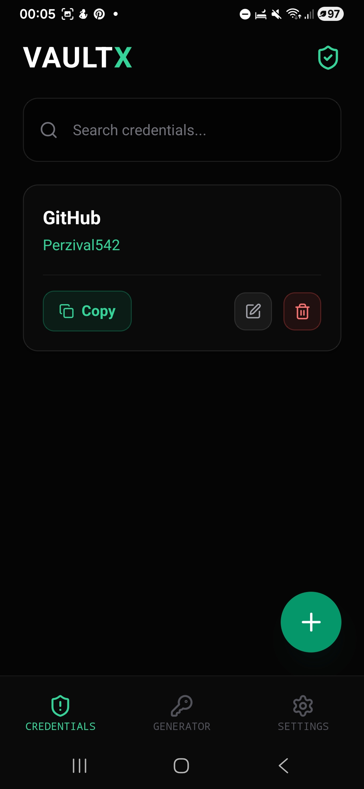
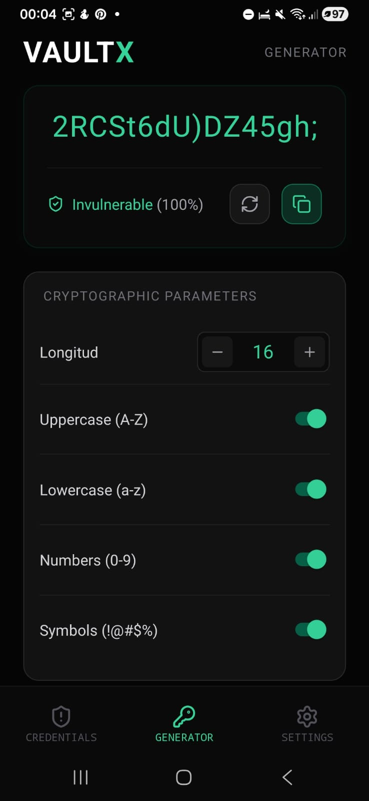
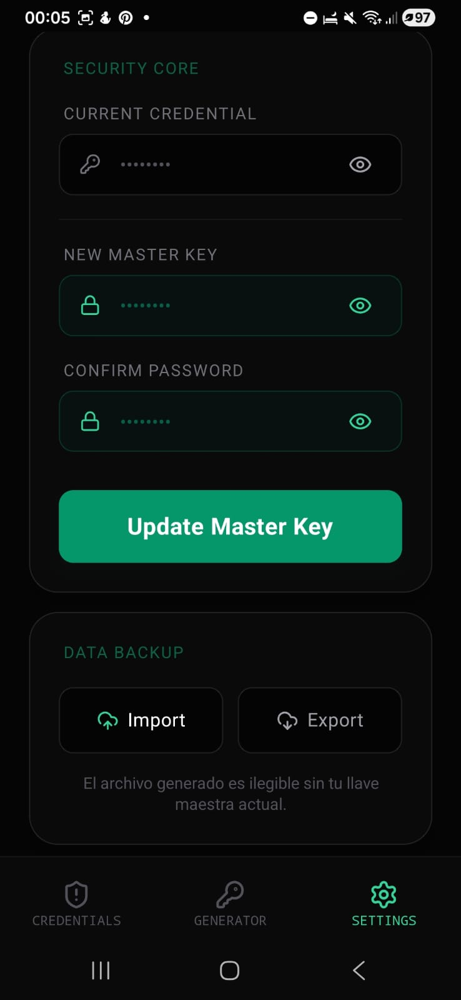
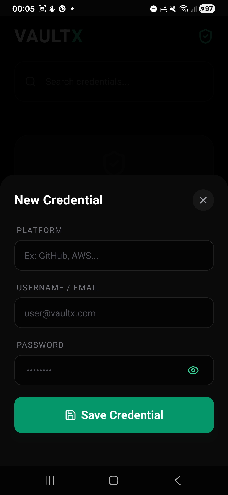

# VaultX 🛡️

[](https://opensource.org/licenses/MIT)
[](https://reactnative.dev/)
[](https://www.typescriptlang.org/)
[](https://jestjs.io/)

**VaultX** is a military-grade, local-first password manager built with security and privacy as its core pillars. Designed for users who demand total control over their data without relying on third-party cloud providers.

[Leer en Español 🇪🇸](./README.es.md)

## 🚀 Key Features

* **Offline-First Architecture:** Your data never leaves your device.
* **Military-Grade Encryption:** AES-256-CBC for credential storage.
* **Biometric Authentication:** FaceID/TouchID integration for seamless and secure access.
* **Secure Backup System:** Encrypted cryptographic envelopes (.vaultx) for data portability.
* **Safety UI:** Automatic clipboard clearing and screenshot prevention.
* **Unit Testing:** Core encryption and backup logic verified with Jest.

## 🛠️ Tech Stack

* **Frontend:** React Native (Expo) with TypeScript.
* **Styling:** NativeWind (Tailwind CSS).
* **Storage:** SQLite for structured data & Expo SecureStore for sensitive keys.
* **Crypto:** CryptoJS (SHA-256 for key derivation & AES-256 for encryption).

## 🔐 Security Architecture (The "Flex")

VaultX doesn't just store passwords; it protects them through a multi-layered security approach:

1.  **Key Derivation:** The User Master Key is never stored. We use **SHA-512** to create a validation hash and **SHA-256** to derive the actual encryption key.
2.  **Encryption:** Credentials are encrypted using **AES-256-CBC** with a unique Initialization Vector (IV) for every entry.
3.  **Encrypted Backups:** Backups are wrapped in a cryptographic envelope that includes a signature (`VAULTX_SECURE_CORE`) to prevent tampering and ensure file integrity.

## 📸 Interface Preview

<p align="center">
  
</p>

| Biometric Access | Encrypted Vault | Password Generator |
| :---: | :---: | :---: |
|  |  |  |

### 🔐 Advanced Management

| Encrypted Backups | Clean UX / Modals |
| :---: | :---: |
|  |  |

## 🧪 Testing

We take security seriously. The core logic is covered by unit tests:

```bash
# Run the test suite
npm run test
```

## ⚙️ Installation & Execution
Clone the repository: git clone https://github.com/your-username/vaultx.git

Install dependencies:
```bash
npm install
```

Start the Metro bundler:
```bash
npx expo start
```